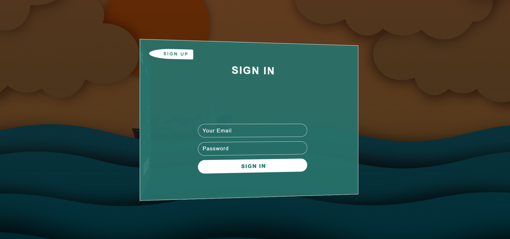

# 3d_Sign_UpIn_Form

## Description
this project uses HTML, CSS< And JavaScript.  CSS is used to give the forms a #D look.  A class is added or removed to rotate the form conatiner and display a form depending on which button the user clicks on.

## Demo
A demo for the project can be found at: https://tod619.github.io/3d_Sign_UpIn_Form/
